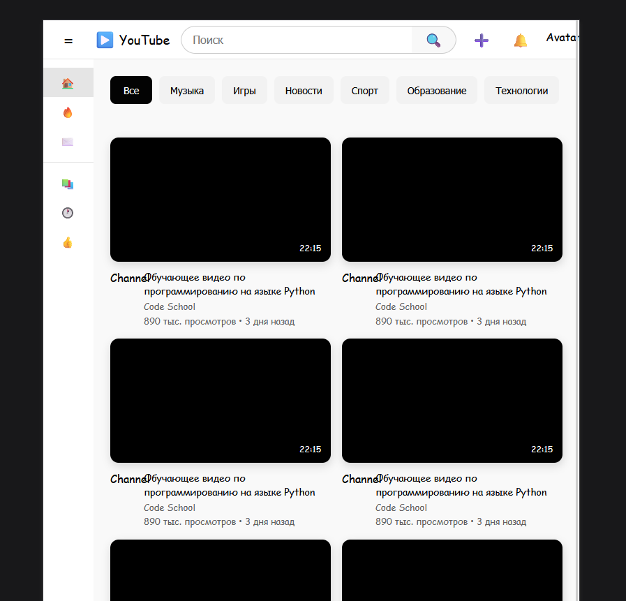
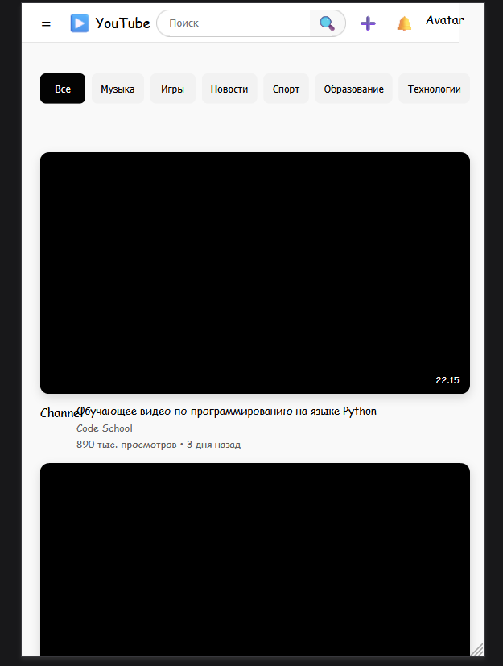

# YouTube Clone - Лабораторная работа №10-11

**Студент:** Федотова В.С.
**Группа:** ИСП-232
---
## Описание
Адаптивный клон главной страницы YouTube, созданный с использованием современных подходов в вёрстке. Проект разработан в рамках лабораторнох работ №10-№11, посвященной изучению Flexbox и CSS Grid для построения сложных макетов веб-страниц.
---
## Реализованные функции
- [x] Адаптивный хедер с поиском
- [x] Боковая панель навигации
- [x] Категории (чипсы) с интерактивностью
- [x] Сетка видео с карточками
- [x] Hover-эффекты на карточках
- [x] Полная адаптивность под все устройства
---
## Технологии
- HTML5
- CSS3
- Flexbox
- CSS Grid
- Media Queries
---
## Скриншоты
### Desktop (1920px)

### Tablet (1024px)

### Mobile (375px)

---
## Как запустить
1. Откройте файл `index.html` в браузере
2. Или используйте **Live Server** в VS Code:
- Установите расширение Live Server
- Правой кнопкой по `index.html` → Open with Live Server
---
## Структура проекта
- img/
- index.html
- README.md
- style.css
---
## Вывод
В ходе выполнения лабораторной работы я научился создавать сложные макеты, комбинируя Flexbox и CSS Grid. Был изучен подход к построению адаптивной сетки без использования сторонних библиотек, а также принципы создания микро-интерактивов (hover-эффекты, плавные переходы).
---
## Дата выполнения
13.02.2026